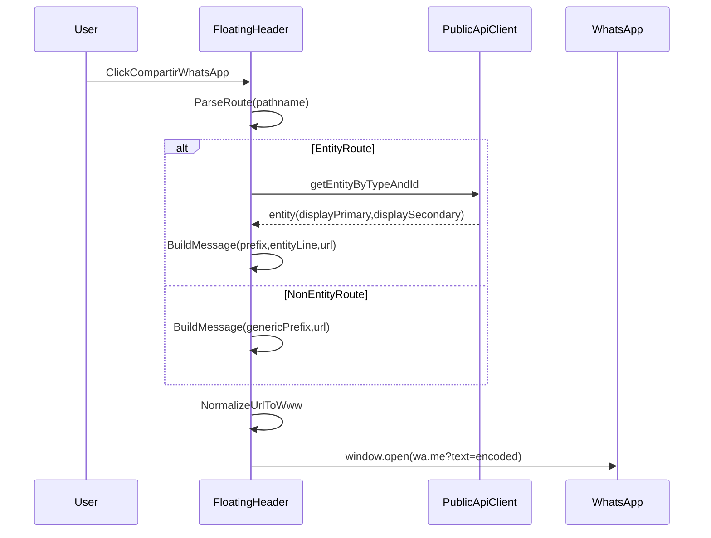

# Plan: WhatsApp Share (Public)

## Goals

- Add a **"Compartir en WhatsApp"** button to the public floating header (all public pages).
- On click, open WhatsApp share with:
- **Entity-specific message prefixes** (Fabrica/Jingle/Artista/Cancion/Tematica)
- **Emojis preserved** from `displayPrimary`/`displaySecondary`
- **URL normalized** to `https://www.jingle.ar/...`
- Provide **reliable WhatsApp previews** using a **single, static preview** for all routes (same OG tags + same OG image).

## Non-goals

- Per-entity OG tags (title/description varying by entity) in crawlers.
- Admin pages (per your selection: public only).

## Implementation approach

### 1) Static Open Graph preview (reliable, same everywhere)

- **Add Open Graph tags to the SPA entrypoint** so WhatsApp’s crawler always sees them:
- File: [frontend/index.html](frontend/index.html)
- Add (at minimum): `og:title`, `og:description`, `og:image`, `og:url`, `og:type`, plus `twitter:card`.
- Use `og:url` as `https://www.jingle.ar/` (static).
- **Add a static OG image asset** (same for all shared links).
- Source image in repo: [frontend/src/assets/images/Cooperativa jingle.ar.jpg](frontend/src/assets/images/Cooperativa%20jingle.ar.jpg)
- Copy into: `frontend/public/share/og-image.jpg` (or similar stable, non-hashed path)
- Reference in OG tags: `https://www.jingle.ar/share/og-image.jpg`

Why this works: nginx serves the built SPA via `try_files ... /index.html`, so crawlers will receive the same HTML for all routes, and static OG tags will be present.

### 2) WhatsApp share button in FloatingHeader (public)

- Add a new button to the existing right-side button group in:
- [frontend/src/components/composite/FloatingHeader.tsx](frontend/src/components/composite/FloatingHeader.tsx)
- Button content: **icon-only** (WhatsApp logo)
- Icon assets:
- Primary: [frontend/src/assets/images/wa-whatsapp-icon.webp](frontend/src/assets/images/wa-whatsapp-icon.webp)
- Fallback: [frontend/src/assets/images/wa-whatsapp-icon.png](frontend/src/assets/images/wa-whatsapp-icon.png)
- Accessibility: `aria-label="Compartir en WhatsApp"` (and/or visually-hidden text)

### 3) Share URL + message builder (entity-specific)

Create a small utility/hook that:

- **Normalizes URL host**:
- Replace the current `window.location.href` origin with `https://www.jingle.ar`
- Keep the same path/query/hash
- **Detects entity type + id from pathname**:
- `/f/:id` => Fabrica
- `/j/:id` => Jingle
- `/a/:id` => Artista
- `/c/:id` => Cancion
- `/t/:id` => Tematica
- Also handle Fabrica heading route (`/show/:id`) as Fabrica for message prefix and entity fetch, but **keep the shared URL as `/show/:id`** (do not rewrite to `/f/:id`).
- **Builds message text** (emojis preserved):
- Fabrica:
    - `Mira esta Fabrica en la Cooperativa jingle.ar:`
- Jingle:
    - `Mira este Jingle en la Cooperativa jingle.ar:`
- Artista:
    - `Mira este Artista en la Cooperativa jingle.ar:`
- Cancion:
    - `Mira esta Materia Prima (Cancion) en la Cooperativa jingle.ar:`
- Tematica:
    - `Mira esta Tematica en la Cooperativa jingle.ar:`

Then append a line with:

- If entity page and we can fetch entity:
- `[displayPrimary] | [displaySecondary]` (if secondary exists)
- Always append the normalized URL.

Where to get `displayPrimary`/`displaySecondary`:

- Use existing per-entity API methods in `PublicApiClient` (no generic `/entities/:type/:id` client method required):
- `getFabrica`, `getJingle`, `getArtista`, `getCancion`, `getTematica`
- File: [frontend/src/lib/api/client.ts](frontend/src/lib/api/client.ts)

Fallback:

- If entity fetch fails or is still loading, send message without entity line (prefix + URL only).

### 4) Open WhatsApp

- Construct:
- `https://wa.me/?text=${encodeURIComponent(message)}`
- Open in a new tab: `window.open(waUrl, '_blank', 'noopener,noreferrer')`

### 5) Styling

- Add a modifier class for the WhatsApp button (optional), keeping visual parity with existing header buttons.
- CSS file: [frontend/src/styles/components/floating-header.css](frontend/src/styles/components/floating-header.css)
- Use `<picture>` with WebP first + PNG fallback for the icon, sized to match existing header button height.

### 6) Nginx allowlisting (optional ops follow-up)

If you want to explicitly allow WhatsApp crawlers, implement at nginx layer (outside the app repo runtime):

- Config reference: [docs/9_ops_deployment/infrastructure/jinglero](docs/9_ops_deployment/infrastructure/jinglero)
- Add allow rules for known WhatsApp crawler user agents/IP ranges (maintainable list required) while keeping other protections intact.

## Verification checklist

- Clicking the button on an entity page opens WhatsApp with:
- Correct prefix for the entity type
- Emojis preserved
- URL host normalized to `https://www.jingle.ar/...`
- Clicking the button on non-entity pages opens WhatsApp with the generic message + normalized URL.
- WhatsApp link preview shows the static OG image/title (Cooperativa billboard) from `frontend/index.html` OG tags.

## Mermaid: share flow

## Files to change/add

- Update: [frontend/src/components/composite/FloatingHeader.tsx](frontend/src/components/composite/FloatingHeader.tsx)
- Add: `frontend/src/lib/share/whatsappShare.ts` (or similar utility module)
- Update: [frontend/index.html](frontend/index.html)
- Add: `frontend/public/share/og-image.jpg` (copied from `frontend/src/assets/images/Cooperativa jingle.ar.jpg` for a stable OG URL)
- Update (optional): [frontend/src/styles/components/floating-header.css](frontend/src/styles/components/floating-header.css)