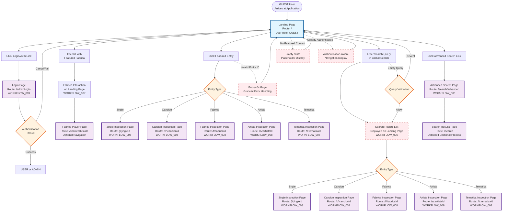
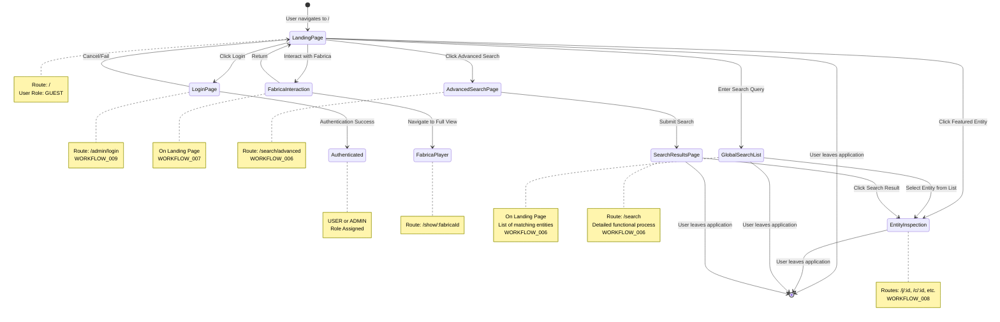

# WORKFLOW_010: Basic Navigation Access - Flow Diagram

## Overview

This diagram visualizes the navigation paths available to GUEST users from the Landing Page, showing all entry points and destinations.

## Flowchart

## State Diagram

## Navigation Paths Summary

### Primary Navigation Paths

1. **Landing → Login**

   - Route: `/` → `/admin/login`
   - User Role: GUEST → USER/ADMIN
   - Related: WORKFLOW_009

2. **Landing → Featured Fabrica Interaction**

   - Route: `/` (stays on landing, interacts with Fabrica)
   - Optional: Navigate to `/show/:fabricaId`
   - Related: WORKFLOW_007

3. **Landing → Featured Entity**

   - Route: `/` → `/j/:id` | `/c/:id` | `/f/:id` | `/a/:id` | `/t/:id`
   - Related: WORKFLOW_008

4. **Landing → Global Search → Entity Inspection**

   - Route: `/` (search on landing) → Entity list displayed → `/j/:id` | `/c/:id` | `/f/:id` | `/a/:id` | `/t/:id` (entity selection)
   - Related: WORKFLOW_006, WORKFLOW_008

5. **Landing → Advanced Search → Search Results Page**

   - Route: `/` → `/search/advanced` → `/search` (detailed functional process)
   - Related: WORKFLOW_006

### Edge Case Paths

- **Empty Content**: Landing Page → Empty State → Landing Page
- **Already Authenticated**: Landing Page → Auth-Aware Display → Landing Page
- **Invalid Entity**: Featured Entity → Error Page → Landing Page
- **Empty Search**: Global Search → Validation → Landing Page or Search List

## Key States

- **Landing Page**: Central hub, all navigation originates here
- **Destination Pages**: Final destinations for user actions
- **Workflow References**: Points where other workflows take over
- **Edge Cases**: Error and validation states (shown with dashed lines)

## Related Workflows

- **WORKFLOW_005**: Landing Page (detailed design)
- **WORKFLOW_006**: Search and Discovery (search functionality)
- **WORKFLOW_007**: Fabrica Viewing (Fabrica interaction)
- **WORKFLOW_008**: Entity Inspection (entity page details)
- **WORKFLOW_009**: Admin Authentication (login sequence)

## Notes

- All paths originate from the Landing Page
- Navigation is primarily one-way (user moves forward through the flow)
- Users can return to Landing Page via browser navigation or explicit links
- Edge cases are shown with dashed lines to indicate alternative paths
- Workflow references indicate where detailed workflows take over
