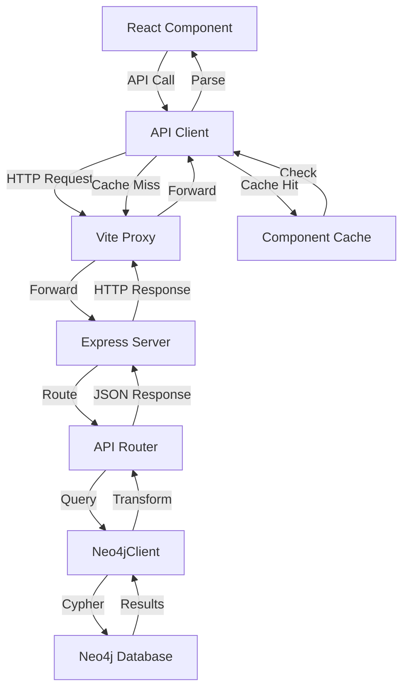

# Data Flow Architecture

## Status

- **Status**: current_implementation
- **Last Updated**: 2025-11-19
- **Code Reference**: `frontend/src/lib/api/client.ts`, `backend/src/server/api/`, `backend/src/server/db/index.ts`

## Overview

The system uses a three-tier architecture: React frontend, Express.js backend, and Neo4j graph database. Data flows through RESTful API endpoints with clear separation between public (read-only) and admin (read-write) operations.

## Frontend to Backend Flow

### API Call Patterns

**Pattern**: Centralized API client classes with typed methods

- **Public API**: Read-only operations via `PublicApiClient`
- **Admin API**: Full CRUD operations via `AdminApiClient` (extends PublicApiClient)
- **Code Reference**: `frontend/src/lib/api/client.ts:97-279` (PublicApiClient), `frontend/src/lib/api/client.ts:282-883` (AdminApiClient)

**Endpoints Structure**:

- Public API: `/api/public/*` - Read-only entity and relationship endpoints
- Admin API: `/api/admin/*` - Full CRUD operations with authentication
- Search API: `/api/search` - Global search across entities
- **Code Reference**: `backend/src/server/index.ts:24-29`

### Request/Response Flow

1. **Frontend Request**:

   - Components call API client methods (e.g., `publicApi.getJingle(id)`)
   - API client uses native `fetch()` API
   - Requests include authentication headers for admin endpoints
   - **Code Reference**: `frontend/src/lib/api/client.ts:101-117` (get method), `frontend/src/lib/api/client.ts:328-372` (admin get method)

2. **Vite Proxy**:

   - Development proxy forwards `/api/*` to `http://localhost:3000`
   - **Code Reference**: `frontend/vite.config.ts:24-30`

3. **Backend Routing**:

   - Express routes handle requests based on path prefix
   - Middleware handles CORS, JSON parsing, error handling
   - **Code Reference**: `backend/src/server/index.ts:14-35`

4. **Error Handling**:
   - Standardized error format: `{ error: string, code?: string, details?: unknown }`
   - Retry logic with exponential backoff for admin API
   - Network error detection and offline handling
   - **Code Reference**: `frontend/src/lib/api/client.ts:32-95` (parseApiError), `frontend/src/lib/api/client.ts:336-371` (retry logic)

## Backend to Database Flow

### Query Patterns

**Pattern**: Neo4j Cypher queries executed via `Neo4jClient`

- **Read Operations**: `executeQuery()` with READ access mode
- **Write Operations**: `executeWrite()` with WRITE access mode
- **Retry Logic**: Automatic retry with exponential backoff for transient failures
- **Code Reference**: `backend/src/server/db/index.ts:120-150` (executeQuery), `backend/src/server/db/index.ts:152-167` (executeWrite)

**Query Examples**:

- Entity retrieval: `MATCH (e:Entity {id: $id}) RETURN e`
- Relationship traversal: `MATCH (a)-[r:RELATIONSHIP_TYPE]->(b) RETURN a, r, b`
- Complex queries with OPTIONAL MATCH for related entities
- **Code Reference**: `backend/src/server/api/public.ts:188-196` (jingles query), `backend/src/server/api/search.ts:188-226` (search queries)

### Data Transformation

1. **Neo4j to JSON**:

   - Neo4j DateTime objects converted to ISO strings
   - Neo4j Integer objects converted to JavaScript numbers
   - Property extraction from Neo4j records
   - **Code Reference**: `backend/src/server/api/public.ts:10-74` (convertNeo4jDates), `backend/src/server/db/index.ts:137-143` (record mapping)

2. **Response Formatting**:
   - Standardized entity structure with all properties
   - Relationship data includes properties (timestamp, order, etc.)
   - Pagination support with limit/offset
   - **Code Reference**: `backend/src/server/api/public.ts:188-196` (entity queries)

### Caching Layers

**Current Implementation**: Client-side request caching only

- Component-level caching in `RelatedEntities` component
- Cache key: `${entityId}-${entityType}-${relationshipKey}`
- Cache persists for component lifecycle
- **Code Reference**: `frontend/src/components/common/RelatedEntities.tsx:1122-1128` (cache implementation)

**Server-Side Caching**: Not currently implemented

- All database queries execute directly
- No Redis or in-memory caching layer

## Data Flow Diagram

## Implementation

### Frontend API Client

- **Location**: `frontend/src/lib/api/client.ts`
- **Pattern**: Class-based API clients with typed methods
- **Features**: Error handling, retry logic, offline detection, authentication

### Backend API Routers

- **Public API**: `backend/src/server/api/public.ts`
- **Admin API**: `backend/src/server/api/admin.ts`
- **Search API**: `backend/src/server/api/search.ts`
- **Pattern**: Express Router with async handlers

### Database Client

- **Location**: `backend/src/server/db/index.ts`
- **Pattern**: Singleton Neo4jClient with retry logic
- **Features**: Connection pooling, transaction management, error handling

## Change History

- **2025-11-19**: Initial baseline documentation
  - Documented current three-tier architecture
  - Documented API client patterns
  - Documented Neo4j query patterns
  - Documented client-side caching implementation
