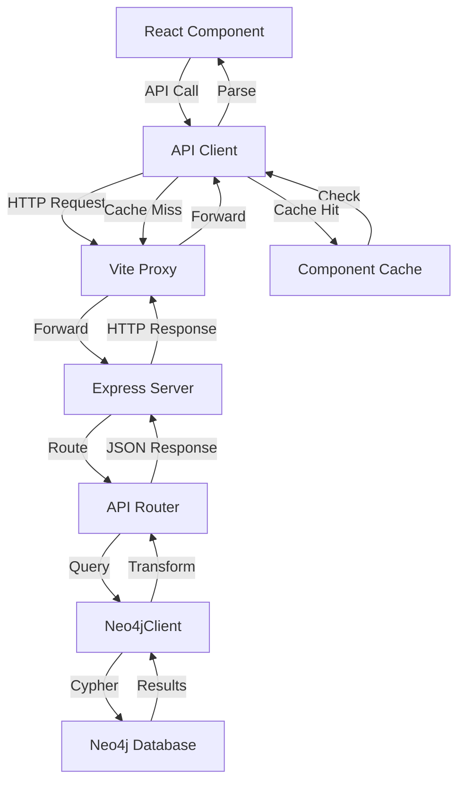
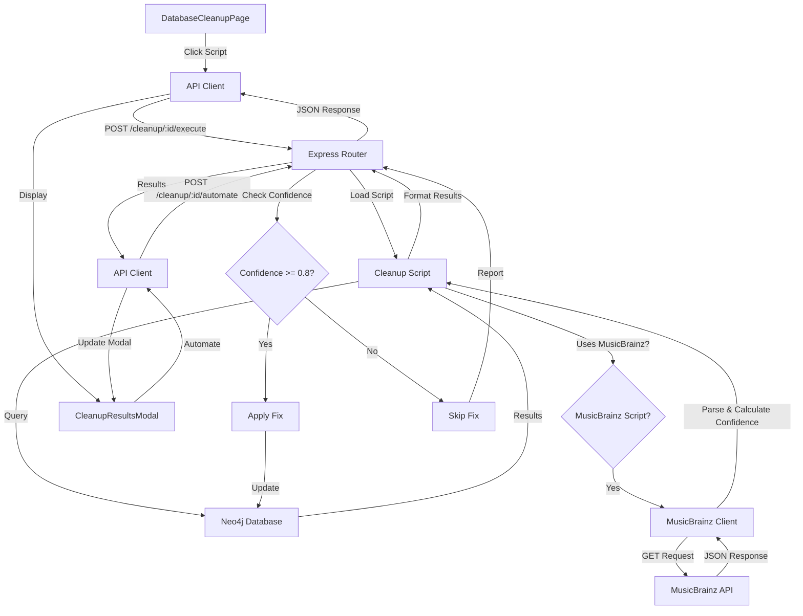

# Data Flow Architecture

## Status

- **Status**: current_implementation
- **Last Updated**: 2025-11-29
- **Code Reference**: `frontend/src/lib/api/client.ts`, `backend/src/server/api/`, `backend/src/server/db/index.ts`

## Overview

The system uses a three-tier architecture: React frontend, Express.js backend, and Neo4j graph database. Data flows through RESTful API endpoints with clear separation between public (read-only) and admin (read-write) operations.

## Frontend to Backend Flow

### API Call Patterns

**Pattern**: Centralized API client classes with typed methods

- **Public API**: Read-only operations via `PublicApiClient`
- **Admin API**: Full CRUD operations via `AdminApiClient` (extends PublicApiClient)
- **Code Reference**: `frontend/src/lib/api/client.ts:97-279` (PublicApiClient), `frontend/src/lib/api/client.ts:282-883` (AdminApiClient)

**Endpoints Structure**:

- Public API: `/api/public/*` - Read-only entity and relationship endpoints
- Admin API: `/api/admin/*` - Full CRUD operations with authentication
- Search API: `/api/search` - Global search across entities
- **Code Reference**: `backend/src/server/index.ts:24-29`

### Request/Response Flow

1. **Frontend Request**:

   - Components call API client methods (e.g., `publicApi.getJingle(id)`)
   - API client uses native `fetch()` API
   - Requests include authentication headers for admin endpoints
   - **Code Reference**: `frontend/src/lib/api/client.ts:101-117` (get method), `frontend/src/lib/api/client.ts:328-372` (admin get method)

2. **Vite Proxy**:

   - Development proxy forwards `/api/*` to `http://localhost:3000`
   - **Code Reference**: `frontend/vite.config.ts:24-30`

3. **Backend Routing**:

   - Express routes handle requests based on path prefix
   - Middleware handles CORS, JSON parsing, error handling
   - **Code Reference**: `backend/src/server/index.ts:14-35`

4. **Error Handling**:
   - Standardized error format: `{ error: string, code?: string, details?: unknown }`
   - Retry logic with exponential backoff for admin API
   - Network error detection and offline handling
   - **Code Reference**: `frontend/src/lib/api/client.ts:32-95` (parseApiError), `frontend/src/lib/api/client.ts:336-371` (retry logic)

## Backend to Database Flow

### Query Patterns

**Pattern**: Neo4j Cypher queries executed via `Neo4jClient`

- **Read Operations**: `executeQuery()` with READ access mode
- **Write Operations**: `executeWrite()` with WRITE access mode
- **Retry Logic**: Automatic retry with exponential backoff for transient failures
- **Code Reference**: `backend/src/server/db/index.ts:120-150` (executeQuery), `backend/src/server/db/index.ts:152-167` (executeWrite)

**Query Examples**:

- Entity retrieval: `MATCH (e:Entity {id: $id}) RETURN e`
- Relationship traversal: `MATCH (a)-[r:RELATIONSHIP_TYPE]->(b) RETURN a, r, b`
- Complex queries with OPTIONAL MATCH for related entities
- **Code Reference**: `backend/src/server/api/public.ts:188-196` (jingles query), `backend/src/server/api/search.ts:188-226` (search queries)

### Data Transformation

1. **Neo4j to JSON**:

   - Neo4j DateTime objects converted to ISO strings
   - Neo4j Integer objects converted to JavaScript numbers
   - Property extraction from Neo4j records
   - **Code Reference**: `backend/src/server/api/public.ts:10-74` (convertNeo4jDates), `backend/src/server/db/index.ts:137-143` (record mapping)

2. **Response Formatting**:
   - Standardized entity structure with all properties
   - Relationship data includes properties (timestamp, order, etc.)
   - Pagination support with limit/offset
   - **Code Reference**: `backend/src/server/api/public.ts:188-196` (entity queries)

### Caching Layers

**Current Implementation**: Client-side request caching only

- Component-level caching in `RelatedEntities` component
- Cache key: `${entityId}-${entityType}-${relationshipKey}`
- Cache persists for component lifecycle
- **Code Reference**: `frontend/src/components/common/RelatedEntities.tsx:1122-1128` (cache implementation)

**Server-Side Caching**: Not currently implemented

- All database queries execute directly
- No Redis or in-memory caching layer

## Data Flow Diagram

## Implementation

### Frontend API Client

- **Location**: `frontend/src/lib/api/client.ts`
- **Pattern**: Class-based API clients with typed methods
- **Features**: Error handling, retry logic, offline detection, authentication

### Backend API Routers

- **Public API**: `backend/src/server/api/public.ts`
- **Admin API**: `backend/src/server/api/admin.ts`
- **Search API**: `backend/src/server/api/search.ts`
- **Pattern**: Express Router with async handlers

### Database Client

- **Location**: `backend/src/server/db/index.ts`
- **Pattern**: Singleton Neo4jClient with retry logic
- **Features**: Connection pooling, transaction management, error handling

## Cleanup Feature Data Flow

### Overview

The cleanup feature provides database maintenance operations through a dedicated API. Some cleanup scripts integrate with external MusicBrainz API to fetch metadata and suggest matches.

**Workflow Reference**: See `docs/1_frontend_ux-workflows/workflows/admin-experience/WORKFLOW_011_database-cleanup.md`

**API Reference**: See `docs/5_backend_api-contracts/contracts/admin-api-cleanup.md`

### Cleanup Script Execution Flow

1. **Frontend Request**:
   - User clicks cleanup script button in `DatabaseCleanupPage`
   - Component calls `adminApi.executeCleanupScript(scriptId)`
   - API client sends POST request to `/api/admin/cleanup/:scriptId/execute`
   - **Code Reference**: `frontend/src/pages/admin/DatabaseCleanupPage.tsx` (to be created), `frontend/src/lib/api/client.ts` (to be added)

2. **Backend Script Execution**:
   - Express router receives request at `/api/admin/cleanup/:scriptId/execute`
   - Router loads script module from `backend/src/server/db/cleanup/`
   - Script executes database queries to identify issues
   - **Code Reference**: `backend/src/server/api/admin.ts` (to be created)

3. **Database Query Execution**:
   - Script uses Neo4jClient to execute Cypher queries
   - Queries identify entities with issues (missing relationships, incomplete data, etc.)
   - Results collected and formatted
   - **Code Reference**: `backend/src/server/db/cleanup/` (to be created)

4. **Results Processing**:
   - Script formats results with entity details and suggestions
   - Suggestions include automatable fixes
   - Results returned to frontend
   - **Code Reference**: `backend/src/server/db/cleanup/` (to be created)

5. **Frontend Display**:
   - Results displayed in `CleanupResultsModal`
   - User can review issues and suggested fixes
   - User can trigger automation for automatable fixes
   - **Code Reference**: `frontend/src/components/admin/CleanupResultsModal.tsx` (to be created)

### MusicBrainz Integration Flow

**Scripts Using MusicBrainz**: Scripts 5, 6, 8, 9, 10 (see cleanup operations documentation)

1. **MusicBrainz API Call**:
   - Backend script makes GET request to MusicBrainz API
   - Base URL: `https://musicbrainz.org/ws/2/`
   - Endpoints used:
     - Search: `/recording/?query={query}&fmt=json`
     - Lookup: `/recording/{mbid}?fmt=json&inc=artist-credits+releases`
     - Artist Search: `/artist/?query={query}&fmt=json`
   - **Rate Limiting**: 1 request per second (enforced by backend)
   - **Code Reference**: `backend/src/server/db/cleanup/musicbrainz-client.ts` (to be created)

2. **MusicBrainz Response Processing**:
   - MusicBrainz API returns JSON response
   - Backend parses response and extracts relevant data
   - Confidence score calculated based on match quality:
     - Exact title match: 0.9-1.0
     - Title + artist match: 0.85-0.95
     - Partial match: 0.6-0.8
     - Low confidence: < 0.6
   - **Code Reference**: `backend/src/server/db/cleanup/musicbrainz-client.ts` (to be created)

3. **Data Transformation**:
   - MusicBrainz data transformed to internal format
   - MusicBrainz ID assigned to entity
   - `musicBrainzConfidence` property set (0.0 to 1.0)
   - Missing metadata backfilled (album, year, genre, etc.)
   - **Code Reference**: `backend/src/server/db/cleanup/` (to be created)

4. **Error Handling**:
   - MusicBrainz API failures handled gracefully
   - Errors logged and reported in script results
   - Script continues execution even if MusicBrainz API unavailable
   - Retry logic with exponential backoff for transient failures
   - **Code Reference**: `backend/src/server/db/cleanup/musicbrainz-client.ts` (to be created)

### Automation Flow

1. **Frontend Request**:
   - User clicks "Automate Suggested Fixes" in results modal
   - Component calls `adminApi.automateCleanupFixes(scriptId, entityIds, applyLowConfidence)`
   - API client sends POST request to `/api/admin/cleanup/:scriptId/automate`
   - **Code Reference**: `frontend/src/components/admin/CleanupResultsModal.tsx` (to be created)

2. **Backend Automation**:
   - Express router receives automation request
   - Router loads script module and applies fixes
   - For each entity:
     - Checks `musicBrainzConfidence` property (if applicable)
     - If confidence < 0.8 and `applyLowConfidence: false`, skips automation
     - If confidence >= 0.8, applies fix automatically
     - Updates entity properties or creates relationships
   - **Code Reference**: `backend/src/server/api/admin.ts` (to be created)

3. **Database Updates**:
   - Neo4jClient executes write operations
   - Properties updated (e.g., `musicBrainzId`, `musicBrainzConfidence`)
   - Relationships created (e.g., `AUTOR_DE`, `APPEARS_IN`)
   - Entities created (e.g., new `Artista` nodes)
   - **Code Reference**: `backend/src/server/db/cleanup/` (to be created)

4. **Results Processing**:
   - Automation results collected (successful, failed, skipped)
   - Results returned to frontend
   - Frontend updates results modal to show applied fixes
   - **Code Reference**: `backend/src/server/api/admin.ts` (to be created)

### Cleanup Feature Data Flow Diagram

### Component Architecture

**Frontend Components**:
- `DatabaseCleanupPage`: Main page component managing script execution state
- `CleanupScriptButton`: Individual script button with loading state
- `CleanupResultsModal`: Modal displaying results and automation options
- `CleanupScriptSection`: Section grouping scripts by entity type

**State Management**:
- `scripts`: List of available cleanup scripts
- `runningScripts`: Set of currently executing script IDs
- `results`: Current script execution results
- `showResultsModal`: Modal visibility state
- `selectedScript`: Currently selected script ID
- `automating`: Automation in progress state

**Code Reference**: `frontend/src/pages/admin/DatabaseCleanupPage.tsx` (to be created)

### Performance Considerations

- **Script Execution**: Scripts execute asynchronously, may take 5-60 seconds
- **MusicBrainz Rate Limiting**: 1 request per second enforced to respect API limits
- **Large Result Sets**: Results paginated for scripts finding many issues
- **Concurrent Execution**: Multiple scripts can run simultaneously (if backend supports)
- **Caching**: MusicBrainz responses not cached (always fresh data)

### Error Handling

- **Script Execution Errors**: Reported in script results with error details
- **MusicBrainz API Errors**: Handled gracefully, errors reported in results
- **Automation Errors**: Partial success supported, individual failures reported
- **Network Errors**: Retry logic with exponential backoff
- **Timeout Handling**: 30-second timeout for MusicBrainz API calls

## Change History

- **2025-11-19**: Initial baseline documentation
  - Documented current three-tier architecture
  - Documented API client patterns
  - Documented Neo4j query patterns
  - Documented client-side caching implementation
- **2025-11-29**: Added cleanup feature data flow
  - Documented cleanup script execution flow
  - Documented MusicBrainz integration architecture
  - Documented automation flow
  - Documented component architecture and state management
