# Admin Portal - Metadata and Relationship Edit Workflow

```mermaid
flowchart TD
    Start([Start]) --> Navigate[Navigate to Entity]
    Navigate --> CheckEntity{Entity Valid?}

    CheckEntity -->|No| Error[Error: Invalid Entity]
    Error --> EndError([End])

    CheckEntity -->|Yes| DisplayEntity[Display Entity<br/>View Mode]
    DisplayEntity --> ShowMetadata[Show Metadata Panel]
    ShowMetadata --> ShowPlaceholder[Show Placeholder Relationships]
    ShowPlaceholder --> ClickEditar[2. Click Editar Button]
    ClickEditar --> EnterEdit[3. Enter Edit Mode]
    EnterEdit --> ShowEditUI[Show Edit UI:<br/>Guardar inactive<br/>Cancelar, Borrar]
    ShowEditUI --> ShowEmptyRows[Show Empty Relationship Rows]
    ShowEmptyRows --> HidePlaceholder[Hide Placeholder Relationships]
    HidePlaceholder --> UserAction{User Action?}

    %% Branch 3a: Make Changes
    UserAction -->|3a. Make Changes| MakeChanges[Make Changes to<br/>Metadata or Relationships]
    MakeChanges --> ActivateGuardar[Activate Guardar Button]
    ActivateGuardar --> HighlightProps[Highlight Modified Properties<br/>green border]
    HighlightProps --> ActionAfterChanges{Action After Changes?}

    %% Branch 4a: Navigate Away with Changes
    ActionAfterChanges -->|4a. Navigate Away| NavigateAway[Attempt Navigation]
    NavigateAway --> NavModal[Show Navigation Warning Modal:<br/>Cancelar<br/>Descartar y seguir<br/>Guardar y seguir]
    NavModal --> NavChoice{Modal Choice?}

    NavChoice -->|Cancelar| StayOnPage[Stay on Page]
    StayOnPage -.->|Return| ActionAfterChanges

    NavChoice -->|Descartar y seguir| DiscardNav[Discard Changes & Navigate]
    DiscardNav --> NavToNew[Navigate to New Entity]
    NavToNew --> EndNav1([End])

    NavChoice -->|Guardar y seguir| SaveNav[Save Changes<br/>DB commit]
    SaveNav --> NavToNew2[Navigate to New Entity]
    NavToNew2 --> EndNav2([End])

    %% Branch 4b: Press Guardar Button
    ActionAfterChanges -->|4b. Press Guardar| PressGuardar[Press Guardar Button]
    PressGuardar --> CommitDB[Commit Changes<br/>DB + derivatives]
    CommitDB --> ReturnEdit[Return to Edit Mode<br/>Guardar inactive]
    ReturnEdit -.->|Return| ActionAfterChanges

    %% Branch 4c: Press Cancelar Button
    ActionAfterChanges -->|4c. Press Cancelar| PressCancelar[Press Cancelar Button]
    PressCancelar --> CancelModal[Show Discard Warning Modal:<br/>Cancelar<br/>Descartar]
    CancelModal --> CancelChoice{Modal Choice?}

    CancelChoice -->|Cancelar| StayEdit[Stay in Edit Mode]
    StayEdit -.->|Return| ActionAfterChanges

    CancelChoice -->|Descartar| ExitEdit[Exit Edit Mode]
    ExitEdit -.->|Return to View| DisplayEntity

    %% Branch 3b: Navigate Away (No Changes)
    UserAction -->|3b. Navigate Away<br/>No Changes| NavigateNoChanges[Navigate Away<br/>No Changes]
    NavigateNoChanges --> NavNoWarning[Navigate Without Warning]
    NavNoWarning --> EndNav3([End])

    %% Branch 3c: Search Related Entity
    UserAction -->|3c. Search Related Entity| SearchEntity[Search for Related Entity]
    SearchEntity --> MatchFound{Match Found?}

    MatchFound -->|Yes| AddRelationship[Add Relationship]
    AddRelationship -.->|Return| ActionAfterChanges

    MatchFound -->|No| OfferCreate[No Match:<br/>Offer Create New Entity]
    OfferCreate --> OtherChanges{Other Pending<br/>Changes?}

    OtherChanges -->|Yes| ShowModal3c[Show Modal:<br/>Cancelar<br/>Descartar<br/>Guardar]
    ShowModal3c --> Modal3cChoice{Modal Choice?}

    Modal3cChoice -->|Cancelar| StayEdit3c[Stay in Edit Mode]
    StayEdit3c -.->|Return| ActionAfterChanges

    Modal3cChoice -->|Descartar| GoToCreate[Go to Create Entity]
    GoToCreate --> NavToCreate[Navigate to Create Entity]
    NavToCreate --> NewEntityPage[5. New Entity Page<br/>pre-populated]

    Modal3cChoice -->|Guardar| SaveThenCreate[Save Changes<br/>Then Create]
    SaveThenCreate --> NavToCreate2[Navigate to Create Entity]
    NavToCreate2 --> NewEntityPage

    OtherChanges -->|No| GoToCreateDirect[Go to Create<br/>No Modal]
    GoToCreateDirect --> NavToCreate3[Navigate to Create Entity]
    NavToCreate3 --> NewEntityPage

    NewEntityPage --> CreateAction{Create or Cancel?}

    CreateAction -->|Create Entity| CreateEntity[Create New Entity]
    CreateEntity --> ReturnPrev[Return to Previous Entity<br/>Edit Mode]
    ReturnPrev -.->|Return| ActionAfterChanges

    CreateAction -->|Cancel Creation| CancelCreate[Cancel Creation]
    CancelCreate --> ReturnPrev2[Return to Previous Entity<br/>Edit Mode]
    ReturnPrev2 -.->|Return| ActionAfterChanges

    %% Styling
    classDef startEnd fill:#e1f5e1,stroke:#4caf50,stroke-width:3px
    classDef task fill:#fff,stroke:#333,stroke-width:2px
    classDef gateway fill:#fff,stroke:#333,stroke-width:2px
    classDef error fill:#ffebee,stroke:#f44336,stroke-width:2px
    classDef modal fill:#fff3cd,stroke:#ffc107,stroke-width:2px

    class Start,EndError,EndNav1,EndNav2,EndNav3 startEnd
    class Error error
    class NavModal,CancelModal,ShowModal3c modal
```

## Legend

- **Start/End Events**: Green rounded rectangles
- **Tasks/Activities**: White rectangles with black borders
- **Gateways/Decisions**: Diamond shapes
- **Modals**: Yellow-tinted rectangles
- **Return Flows**: Dashed arrows (return to previous state)
- **Error Paths**: Red-tinted rectangles

## Workflow Steps

1. **Navigate to Entity**: User navigates to an entity detail page
2. **Enter Edit Mode**: User clicks "Editar" button to enter edit mode
3. **User Actions**:
   - **3a**: Make changes to metadata or relationships
   - **3b**: Navigate away with no changes (no warning)
   - **3c**: Search for related entity (may lead to entity creation)
4. **Actions After Changes**:
   - **4a**: Navigate away → shows warning modal
   - **4b**: Press Guardar → saves and returns to edit mode
   - **4c**: Press Cancelar → shows discard confirmation modal
5. **Entity Creation Flow**: When no match found, user can create new entity and return to previous entity in edit mode
